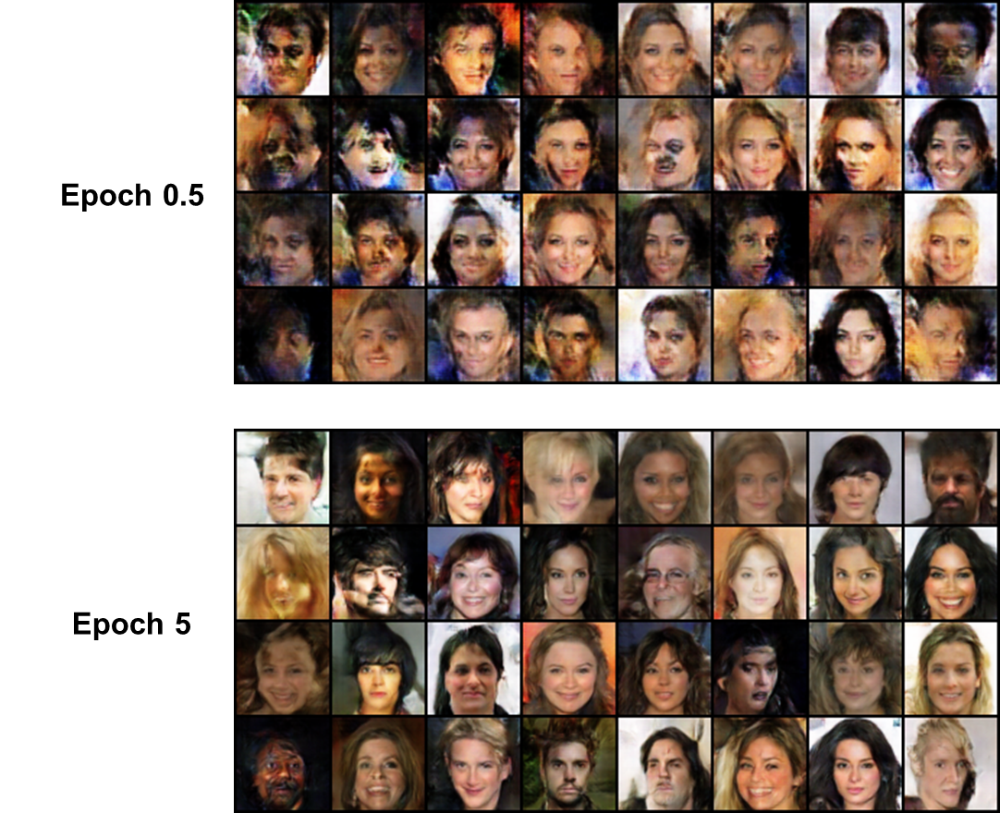

# Self-Attention GAN
Pytorch implementation of Self-Attention Generative Adversarial Networks (SAGAN).
**Zhang, Han, et al. "Self-Attention Generative Adversarial Networks." arXiv preprint arXiv:1805.08318 (2018).**

This repository provides a PyTorch implementation of [SAGAN](https://arxiv.org/abs/1805.08318). Both wgan-gp and wgan-hinge loss are ready, but note that wgan-gp is somehow not compatible with the spectral normalization. Remove all the spectral normalization at the model for the adoption of wgan-gp.

Self-attentions are applied to later two layers of both discriminator and generator.

The pixel-wise self-attention, that is, each pixel takes different attention mask, costs tunes of GPU resource. Batch size of around 8 is available for a single Titan X gpu. You may reduce the number of self-attention modules for less memory consumption.

<p align="center"></p>

## Current update status
* [ ] Supervised setting
* [ ] Better attention visualization
* [ ] Generated image results (under training, aiming for epoch 100)
* [x] Attention visualization (LSUN Church-outdoor)
* [x] Unsupervised setting (use no label yet) 
* [x] Applied: [Spectral Normalization](https://arxiv.org/abs/1802.05957), code from [here](https://github.com/christiancosgrove/pytorch-spectral-normalization-gan)
* [x] Implemented: self-attention module, two-timescale update rule (TTUR), wgan-hinge loss, wgan-gp loss

&nbsp;
&nbsp;

## Results

### Attention result on LSUN (epoch #8)
<p align="center"></p>
Per-pixel attention result of SAGAN on LSUN church-outdoor dataset. It shows that unsupervised training of self-attention module still works somehow, although it is not interpretable with the attention map itself. These are the visualization of self-attention in generator layer3 and layer4, which are in the size of 16 x 16 and 32 x 32 respectively, each for 64 images. To visualize the per-pixel attentions, only a number of pixels are chosen, as shown on the leftmost and the rightmost numbers indicate. 

### CelebA dataset (epoch on the left, still under training)
<p align="center"></p>

### LSUN church-outdoor dataset (epoch on the left, still under training)
<p align="center"></p>

## Prerequisites
* [Python 3.5+](https://www.continuum.io/downloads)
* [PyTorch 0.3.0](http://pytorch.org/)

&nbsp;

## Usage

#### 1. Clone the repository
```bash
$ git clone https://github.com/heykeetae/Self-Attention-GAN.git
$ cd Self-Attention-GAN
```

#### 2. Install datasets (CelebA or LSUN)
```bash
$ bash download.sh CelebA
or
$ bash download.sh LSUN
```

#### 3. Train 
##### (i) Train
```bash
$ python python main.py --batch_size 6 --imsize 64 --dataset celeb --adv_loss hinge --version sagan_1
```
&nbsp;
